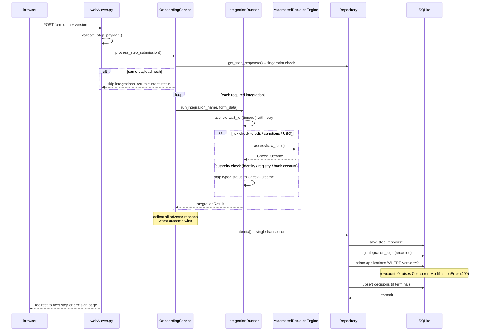
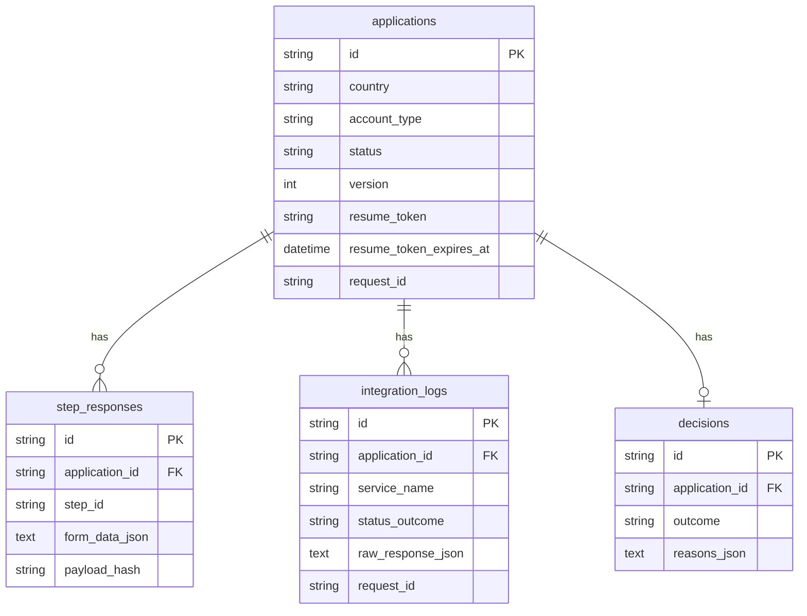

# Architecture

## Step submission flow

What happens on every POST to `/application/{id}/step/{step_id}`.

## Decisioning boundary

Two kinds of check, two owners:

- **Authority checks** (identity, registry, bank account): the provider's status is the verdict. The adapter maps its typed enum (`IdentityStatus`, `RegistryStatus`, `BankAccountStatus`) directly to `CheckOutcome`. We do not re-derive what the external authority already decided.
- **Risk policy checks** (credit, sanctions, UBO, business credit, representative): the provider returns raw facts (`CreditAssessment`, `SanctionsScreening`, etc.). `AutomatedDecisionEngine` maps them to approve/refer/reject. Policy lives in one place, thresholds come from `config.Settings`.

## Data model

## Deliberate decisions

- **`AutomatedDecisionEngine` is in `domain/`.** It is pure business policy with no I/O, so it belongs in the domain, not services.
- **Decision reasons are never shown to the customer.** They are stored in `decisions` for back office only. Showing them would leak thresholds.
- **Optimistic concurrency, not pessimistic.** Holding a row lock while a human fills a form is impractical. The posted `version` feeds `UPDATE ... WHERE version=?`; a stale or tampered value returns 409 and rolls back. No silent overwrite is possible.
- **Integrations run before the transaction opens.** Keeps the DB lock window short. A provider failure before any write leaves nothing in a partial state.
- **Mocks are wired at the composition root**, not swapped by env config. Provider swapping is a production concern.
- **Templates rely on Jinja autoescaping.** No manual escaping added.
