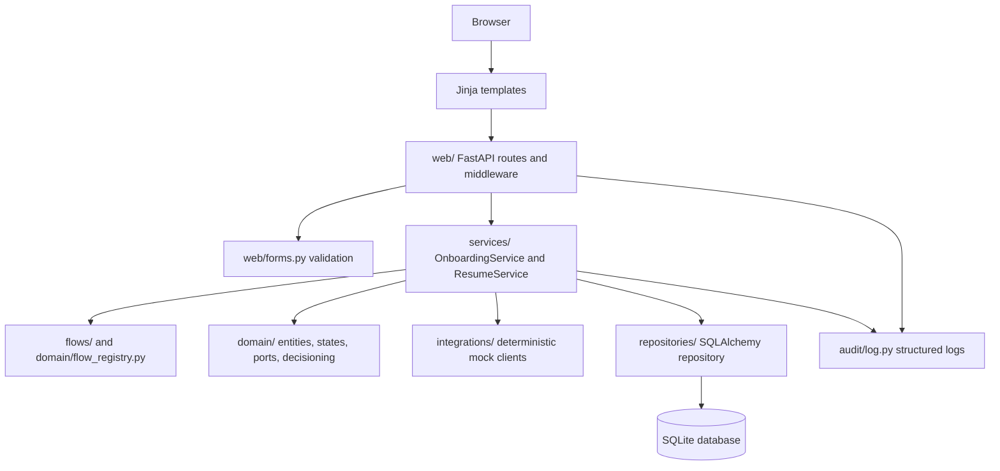

# Architecture

This project is a small server-rendered FastAPI application that models a configurable banking onboarding flow. It is intentionally local and deterministic: no real eID, KYC, registry, credit bureau or bank services are called.

## Goals

- Support six onboarding journeys: Sweden, Spain and Poland for private and business customers.
- Keep country/customer-type flow differences explicit and easy to test.
- Persist application state, step responses, integration outcomes and final status.
- Demonstrate production thinking around validation, redaction, request tracing, resumability and audit-style records.

## Layer Diagram

## Request Flow

1. The customer selects country and account type.
2. The web route creates an application record and redirects to the first configured step.
3. Each step is rendered from `FlowConfig` and `FormFieldConfig`.
4. Submitted form data is validated server-side.
5. `OnboardingService` checks that the step is reachable and the application is not terminal.
6. The step response is redacted for storage and hashed with HMAC-SHA256 for idempotency/change detection.
7. Required mocked integrations are executed for that step.
8. Integration outcomes are persisted to `integration_logs`.
9. The application status moves to `IN_PROGRESS`, `APPROVED`, `MANUAL_REVIEW` or `REJECTED`.
10. A server-issued resume handle is stored in an HTTP-only cookie so `/resume` can return incomplete applications to the first incomplete step without showing the handle to the customer.

## Main Modules

- `web/`: HTTP routes, middleware, dependency wiring and form validation entry points.
- `templates/`: Server-rendered pages for start, step, resume and decision views.
- `flows/`: Declarative country and account-type journey definitions.
- `domain/`: Flow models, entity/status models, ports and simple decisioning rules.
- `services/`: Application use cases: step submission and resumability.
- `integrations/`: Deterministic mock clients for identity, sanctions, credit, registry and bank account checks.
- `repositories/`: SQLAlchemy implementation of the persistence port.
- `db/`: ORM records and database session setup.
- `audit/`: Structured logging helpers.

## Current Tradeoffs

The current design keeps a single `OnboardingService` because the sample is small and the full workflow is easier to read in one place. In a larger production system, this would likely be split into use-case handlers and focused collaborators:

- `SubmitStepHandler`
- `FlowResolver`
- `StepAccessPolicy`
- `StepResponseService`
- `CheckOrchestrator`
- `DecisionService`
- `ApplicationStateService`
- `AuditService`

The service is therefore a deliberate take-home simplification, not the final production boundary.

## Production Direction

For production, provider selection should not be raw strings inside flow configuration. A safer design would separate:

- Flow config: what the customer journey requires.
- Provider capabilities: which countries/customer types each provider supports.
- Country policy: which providers are legally and operationally allowed.
- Startup validation: fail boot if a flow cannot resolve to an allowed provider.
- Runtime guards: providers reject requests for unsupported countries even if configuration is wrong.

That prevents a Swedish flow from accidentally calling a Spanish identity provider, and makes changes reviewable in pull requests and CI.
