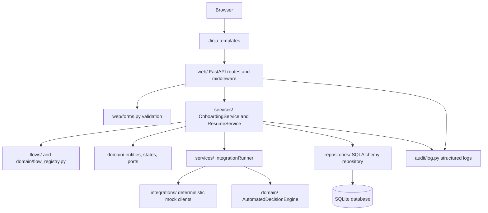
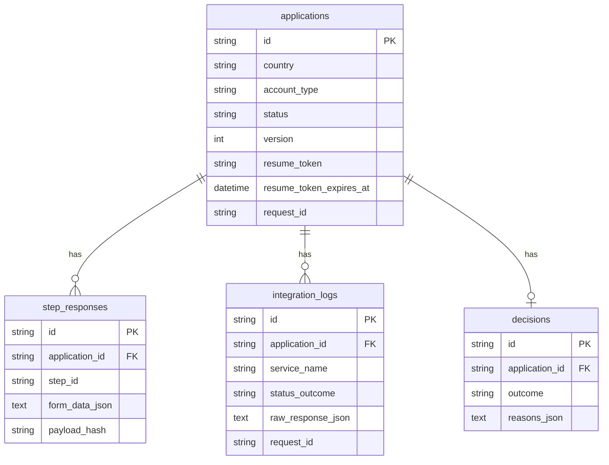

# Architecture

This project is a small server-rendered FastAPI application that models a configurable banking onboarding flow. It is intentionally local and deterministic: no real eID, KYC, registry, credit bureau or bank services are called.

## Goals

- Support six onboarding journeys: Sweden, Spain and Poland for private and business customers.
- Keep country/customer-type flow differences explicit and easy to test.
- Persist application state, step responses, integration outcomes and final status.
- Demonstrate production thinking around validation, redaction, request tracing, resumability and audit-style records.

## Layer Diagram

`OnboardingService` sequences a step. `IntegrationRunner` calls the mock providers. See the decisioning boundary below for where the verdict is made.

## Decisioning boundary (deliberate split)

Two kinds of check, two owners:

- **Risk policy checks** (credit, sanctions, ownership, business credit, representative authority): the provider returns raw facts; `AutomatedDecisionEngine` maps them to approve/refer/reject. Policy lives in one place.
- **Provider authority checks** (identity, registry, bank account): the provider's status IS the verdict (BankID returns verified or failed; the bank does not re-derive identity). The adapter maps its typed status (`IdentityStatus`, `RegistryStatus`, `BankAccountStatus`) to the outcome.

The rule: if the outcome is an external authority's own determination, the adapter returns it; if it is our risk policy over raw facts, the engine decides.

## Request Flow

1. The customer selects country and account type.
2. The web route creates an application record and redirects to the first configured step.
3. Each step is rendered from `FlowConfig` and `FormFieldConfig`.
4. Submitted form data is validated server-side.
5. `OnboardingService` checks that the step is reachable and that the application is still open for customer input (`is_customer_submittable`); the web layer uses the same gate, so the two cannot drift.
6. The step's required checks run first; a content fingerprint (plain SHA-256) detects an unchanged resubmission and skips re-running them.
7. `IntegrationRunner` executes the checks (async, each under a timeout with retry); risk checks go through `AutomatedDecisionEngine`, provider authority checks return their own verdict. All reasons are collected and the worst outcome wins.
8. The step response (stored as entered), the integration outcomes (`integration_logs`, redacted), and the final `decision` (with reasons) are persisted inside a single transaction (`repository.atomic()`).
9. The application status moves to `IN_PROGRESS`, `APPROVED`, `MANUAL_REVIEW` or `REJECTED` under an optimistic version guard (`UPDATE ... WHERE version=?`).
10. A server-issued resume handle is stored in an HTTP-only cookie so `/resume` returns incomplete applications to the first incomplete step.

## Data Model

## Main Modules

- `web/`: HTTP routes, middleware, dependency wiring and form validation entry points.
- `templates/`: Server-rendered pages for start, step, resume and decision views.
- `flows/`: Declarative country and account-type journey definitions.
- `domain/`: Flow models, entity/status models, ports and the `AutomatedDecisionEngine`.
- `services/`: Application use cases (step submission, resumability) and the `IntegrationRunner`.
- `integrations/`: Deterministic mock clients. Risk checks return raw facts for the engine; provider authority checks return a typed status and its verdict.
- `config.py`: Settings, including the decisioning thresholds, injected into the engine at the composition root.
- `domain/exceptions.py` / `web/exceptions.py`: business and web exceptions; persistence and transport exceptions stay at their boundary (repository, integration runner).
- `shared/util.py`: small shared helpers (`new_uuid`, `now_utc`).
- `repositories/`: SQLAlchemy implementation of the persistence port.
- `db/`: ORM records and database session setup.
- `audit/`: Structured logging helpers.

## Current Tradeoffs

Provider plumbing (`IntegrationRunner`) and decision policy (`AutomatedDecisionEngine`) are already separated from `OnboardingService`, which keeps the service focused on sequencing a step. The remaining concerns still inside the service are deliberately left together because the sample is small; in a larger system they would be split the same way, around reasons to change:

- `StepAccessPolicy`: step reachability and submittable state checks.
- `StepResponseService`: redaction, hashing, idempotency.
- `ApplicationStateService`: state transitions and optimistic concurrency.
- `AuditService`: durable audit events.

That remaining grouping is a deliberate take-home simplification, not the final production boundary.

## Production Direction

For production, provider selection should not be raw strings inside flow configuration. A safer design would separate:

- Flow config: what the customer journey requires.
- Provider capabilities: which countries/customer types each provider supports.
- Country policy: which providers are legally and operationally allowed.
- Startup validation: fail boot if a flow cannot resolve to an allowed provider.
- Runtime guards: providers reject requests for unsupported countries even if configuration is wrong.

That prevents a Swedish flow from accidentally calling a Spanish identity provider, and makes changes reviewable in pull requests and CI.

## Reviewed and deliberately kept

Points raised in review that we considered and intentionally did not change, with the reasoning:

- **`AutomatedDecisionEngine` stays in `domain/`.** Mapping facts to a verdict is business policy, not application plumbing; it is pure and deterministic, so it belongs in the domain.
- **The decisioning split is intentional** (see "Decisioning boundary"), not an inconsistency.
- **No silent concurrency overwrite, and no partial writes.** The optimistic `UPDATE ... WHERE version=?` guard means a stale or tampered version returns 409, never an overwrite. The posted form version is typed `int` and only feeds that guard. All writes for a submission run inside one unit of work (`repository.atomic()`): commit once on success, full rollback on any error, so a conflict or duplicate step leaves no partial state. Integrations are async and run before the transaction opens, keeping it short.
- **Decision reasons are stored, not shown.** The `decisions` table keeps them for back office; the customer sees only a generic status and a reference (avoids threshold leakage / tipping off).
- **Templates rely on Jinja autoescaping** for dynamic values; no manual escaping is added.
- **Mocks are wired in the composition root** rather than selected by env config; swapping providers by configuration is a production concern, not a take-home one.
